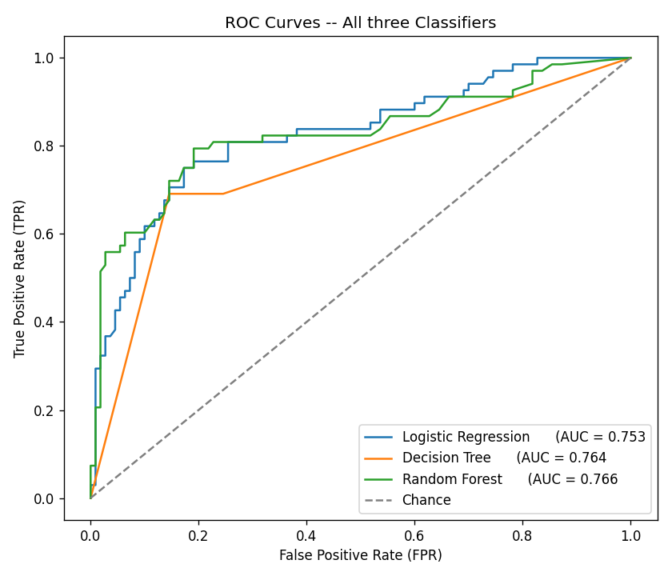

# Analytics Pipeline Module

[](https://www.python.org/)
[](https://pandas.pydata.org/)
[](https://scikit-learn.org/)
[](https://matplotlib.org/)

> **Project module:** End-to-end EDA, visualization, classification, model evaluation, tuning, and regression workflow on the Titanic dataset.

## Technologies Used

- Python
- Pandas
- NumPy
- Seaborn
- Matplotlib
- Scikit-learn
- imbalanced-learn
- Joblib

## Module Structure

```text
analytics/
├── 01_eda.py
├── 02_modeling.py
├── titanic.csv
├── titanic_clean.csv
├── titanic_best_pipeline.joblib
├── Age_distribution_by_Survival_outcome.png
├── Correlation_Heatmap.png
├── decision_tree_plot.png
├── Fare_vs_Age_scatterplot.png
├── pairplot.png
├── residual_plot.png
├── roc_curves.png
├── standardization_before_after.png
├── Survival_rate_by_pclass_and_sex.png
├── Univariate_analysis.png
└── README.md
```

## Visual Outputs

The module produces multiple analytical charts, including:

- Univariate analysis
- Correlation heatmap
- Survival rate by class and sex
- Age distribution by survival outcome
- Fare vs. age scatter plot
- Pair plot
- Standardization before/after comparison
- Decision tree visualization
- ROC curves
- Regression residual plot

---


Analytics Pipeline module (/analytics) covers Zepto's analyst-to-data-scientist workflow in one pass: profiling and cleaning the Titanic dataset, telling a visual story about it, and then building and rigorously evaluating a full predictive-modeling pipeline on the same cleaned data.

The dataset is loaded exactly once, via sns.load_dataset('titanic') in 01_eda.py. Later — EDA, modeling, tuning, the regression side-task — is a continuation of that single load, never an independent reload.

## Contents

- 01_eda.py — Part A: loads and profiles the dataset, missing-value handling, univariate/bivariate/multivariate analysis, and an exploratory standardization check. Saves titanic.csv (offline) and titanic_clean.csv (cleaned data later used by 02_modeling.py).

- 02_modeling.py — Part B: reads titanic_clean.csv, builds a scikit-learn preprocessing + modeling pipeline, trains and evaluates three classifiers, compares imbalance-handling strategies, tunes a Random Forest, runs a regression side-task, and saves the final pipeline via joblib.
- titanic.csv — the one offline copy of the raw dataset, produced by df.to_csv("titanic.csv", index=False) immediately after loading. Grading can proceed via pd.read_csv("titanic.csv") even without internet access.
- titanic_clean.csv — the cleaned DataFrame after Task 2's missing-value handling, used by 02_modeling.py (kept separate from titanic.csv so the raw data stays untouched).
- Saved chart images — see Charts Produced below.
- titanic_best_pipeline.joblib — the complete pipeline (preprocessing + best-performing classifier) saved via joblib.dump, and confirmed reloadable and usable on raw, unpreprocessed input.

Both scripts wrap every task in its own try/except block, so a failure in one task is reported and the rest of the script continues rather than crashing.

## Install / Run Steps

Install dependencies (from the root requirements.txt, which includes seaborn, scikit-learn, imbalanced-learn, joblib, matplotlib alongside the data-pipeline dependencies):
```bash
pip install -r requirements.txt
```

Run Part A (EDA):
```bash
cd analytics
python 01_eda.py
```


Requires internet access on first run (to fetch and cache the Titanic dataset via seaborn). Produces titanic.csv, titanic_clean.csv, and all chart PNGs listed below.

Run Part B (modeling):
```bash
python 02_modeling.py
```


Reads titanic_clean.csv (no re-download). Produces the trained-model evaluation output, tuning results, regression results, and titanic_best_pipeline.joblib.

## Charts Produced

| File | Task | Description |
| --- | --- | --- |
| Univariate_analysis.png | 3 | Histogram + box plot for age and fare |
| Correlation_Heatmap.png | 4 | 6×6 correlation heatmap |
| Survival_rate_by_pclass_and_sex.png | 5 | Survival rate by class and sex |
| Age_distribution_by_survival_outcome.png | 5 | Age distribution by survival outcome |
| Fare_vs_Age_scatterplot.png | 5 | Fare vs age, colored by survival |
| pairplot.png | 5 | Pairwise relationships |
| standardization_before_after.png | 6 | Age/fare distributions before vs after z-score standardization |
| decision_tree_plot.png | 9 | Decision tree visualization (depth-limited to 3) |
| roc_curves.png | 10 | ROC curves for all three classifiers |
| residual_plot.png | 13 | Residuals vs predicted fare (regression side-task) |


## Design Decisions

### Missing-value handling (Task 2)


based on measured percentages:

| Column | % Missing | Strategy | Reasoning |
| --- | --- | --- | --- |
| deck | 77.22% | Encoded as its own "Unknown" category (not dropped) | Imputing a cabin deck at this rate would be almost entirely fabricated, but deck plausibly correlates with class/survival, so an informative "missing" category preserves that signal rather than discarding the column. |
| age | 19.87% | Median-imputed | Falls in the 5–30% band; median is robust to outliers and keeps the numeric feature usable. |
| embarked | 0.22% | Rows dropped | Under 5% — dropping of rows is safe. |


embark_town	0.22%	Rows dropped    Under 5% — dropping of rows is safe.
Outlier and skewness findings (Task 3)
Age: 65 IQR outliers (bounds: [2.50, 54.50]).
Fare: 114 IQR outliers (bounds: [-26.76, 65.66]).
Fare — mean 32.10, median 14.45, mode 8.05. Since mean > median > mode, fare is right-skewed: a small number of very high fares pull the mean upward relative to the bulk of lower-fare passengers.
Bivariate findings (Task 4)
Survival rate by sex: male 18.9%, female 74.0%.
Survival rate by pclass: Class 1 = 62.6%, Class 2 = 47.3%, Class 3 = 24.2%.
Survival rate by sex + pclass: female 1st class = 96.7%, female 2nd = 92.1%, female 3rd = 50.0%; male 1st = 36.9%, male 2nd = 15.7%, male 3rd = 13.5%.
Correlation heatmap (6 columns: survived, pclass, age, sibsp, parch, fare). Top 2 strongest correlations: pclass ↔ fare (r = −0.548), then sibsp ↔ parch (r = 0.415). The pclass/fare relationship is expected — fare is largely a proxy for cabin class. The sibsp/parch relationship reflects that passengers traveling with siblings/spouses were also more likely to be traveling with parents/children (family groups).


Multivariate data story (Task 5)

Five charts build a coherent survival narrative:

Class × sex bar chart: women survived at far higher rates than men in every class, and the gap holds across all three classes, though survival for both sexes declines from 1st to 3rd class.
Age × survival box plot: survivors skew slightly younger, consistent with children being prioritized, though the distributions overlap substantially — age alone is a weak predictor.
Fare × age scatter (colored by survival): survivors concentrate at higher fare levels across most ages, reinforcing that fare (as a proxy for class/cabin location) tracks with survival more clearly than age.
Pair plot: confirms the story holistically — survivors cluster toward lower pclass and higher fare, while age shows weaker, noisier separation between outcome groups.

Overall conclusion: class and fare are the dominant survival signals in this dataset, with sex compounding strongly on top of them; age contributes only a weak, secondary signal.

## Exploratory standardization check (Task 6)


Z-score standardization (z = (x − mean) / std) was applied to age and fare as an EDA-stage sanity check only:

| age (before) | age (after) | fare (before) | fare (after) |
| --- | --- | --- | --- |
mean	| 29.32 | 0.0000 | 32.10 |	0.0000 |
std	| 12.98 | 1.0006 | 49.70 | 1.0006 |


Confirms the transform behaves as expected. This does not feed into the modeling pipeline — Part B performs its own train-only scaling (Task 8) to avoid leaking full-dataset statistics into the train/test split.

## Train/test split (Task 7)


Used a stratified split (80/20) on survived. Justification: the target is imbalanced (~61.75% did not survive vs. ~38.25% survived). A plain random split risks producing train/test folds with meaningfully different class ratios by chance, making evaluation metrics noisier and less comparable across models. Stratifying guarantees both splits preserve the original ratio (train: 61.74/38.26, test: 61.80/38.20).

## Preprocessing (Task 8)


Built as a ColumnTransformer (median-impute + StandardScaler for numeric features; most-frequent-impute + OneHotEncoder for sex/embarked) wrapped in a Pipeline. This structurally enforces fit-on-train / transform-only-on-test — no step is ever fit on test data or on the full pre-split dataset, preventing leakage.

## Model Comparison Table (Task 9–10)

| Model | Accuracy | Precision | Recall | F1 | AUC |
| --- | --- | --- | --- | --- | --- |
| Logistic Regression | 0.8090 | 0.7833 | 0.6912 | 0.7344 | 0.8610 |
| Decision Tree | 0.7697 | 0.6901 | 0.7206 | 0.7050 | 0.7541 |
| Random Forest | 0.8202 | 0.7812 | 0.7353 | 0.7576 | 0.8179 |
Imbalance Handling Comparison (Task 11)


Compared on Logistic Regression, train-fold class balance: 439 not-survived vs. 272 survived.

| Strategy | Precision | Recall | F1 |
| --- | --- | --- | --- |
| Baseline (none) | 0.7833 | 0.6912 | 0.7344 |
| class_weight='balanced' | 0.7183 | 0.7500 | 0.7338 |
| SMOTE (train fold only) | 0.7353 | 0.7353 | 0.7353 |


Conclusion: SMOTE (applied to the training fold only, to avoid leakage) produced the highest F1 (0.7353). Given the moderate imbalance (~62/38), reweighting/resampling trades some precision for improved recall on the minority ("survived") class — SMOTE offered the best overall precision/recall trade-off here rather than optimizing either metric in isolation.

## Hyperparameter Tuning (Task 12)


GridSearchCV over Random Forest's n_estimators, max_depth, and max_features (5-fold CV, scored on F1):

Best parameters: max_depth=None, max_features='sqrt', n_estimators=300
Best CV F1 score: 0.7449
OOB score (oob_score=True at construction): 0.8073
## Regression Side-Task (Task 13)


Predicted fare from pclass, sex, age, sibsp, parch, embarked via multivariate linear regression:

| Metric | Value |
| --- | --- |
| MAE | 21.14 |
| RMSE | 41.75 |
| R² | 0.3468 |
| Adjusted R² | 0.3118 |


Heteroscedasticity conclusion: the residual plot shows a fan-shaped spread that widens as predicted fare increases — residual std dev is 13.25 in the low-predicted-fare half vs. 57.25 in the high-predicted-fare half. This is evidence of heteroscedasticity (non-constant error variance across the range of predictions), rather than the random, constant-width scatter expected under homoscedasticity.

## Final Recommendation (Task 14)


Classification and regression metrics are on different scales and are not directly comparable — presented here as two separate metric groups.

Classifiers:

| Model | Accuracy | Precision | Recall | F1 | AUC |
| --- | --- | --- | --- | --- | --- |
| Logistic Regression | 0.8090 | 0.7833 | 0.6912 | 0.7344 | 0.8610 |
| Decision Tree | 0.7697 | 0.6901 | 0.7206 | 0.7050 | 0.7541 |
| Random Forest | 0.8202 | 0.7812 | 0.7353 | 0.7576 | 0.8179 |


Regression:

| Model | MAE | RMSE | R² | Adjusted R² |
| --- | --- | --- | --- | --- |
| Linear Regression (fare) | 21.14 | 41.75 | 0.3468 | 0.3118 |


Recommendation: Of the three classifiers, Random Forest is the strongest candidate to deploy, with F1 = 0.7576, accuracy = 0.8202, and AUC = 0.8179 on the held-out test set. It balances precision (0.7812) and recall (0.7353) better than the alternatives, which matters here since both false positives (wrongly predicting survival) and false negatives (missing an actual survivor) are costly in this domain. The tuned Random Forest from Task 12 (OOB score 0.8073) is a reasonable second choice if slightly more robustness to overfitting is valued over raw interpretability.

## Saved Pipeline (Task 15)


The complete fitted pipeline — preprocessing steps (imputer, encoder, scaler) plus the best-performing classifier (Random Forest, selected by F1) — is saved as a single object via joblib.dump(full_pipeline, "titanic_best_pipeline.joblib"). It was reloaded with joblib.load and confirmed to produce identical predictions on raw, unpreprocessed input, verifying it is usable end-to-end without any manual preprocessing step.

## Notes on Feature Selection


The classification/regression feature sets exclude alive, class, who, adult_male, alone, deck, and embark_town from modeling (though they were used during EDA). alive is a direct textual restatement of survived and would leak the target; the others are redundant with columns already retained (class↔pclass, who/adult_male↔sex+age, alone↔sibsp+parch, embark_town↔embarked).

## Reproducibility Note


Console output for both scripts (profiling summaries, query-equivalent printouts, evaluation tables) is produced directly by 01_eda.py and 02_modeling.py when run — redirect to a file (e.g. python 01_eda.py > eda_output.txt 2>&1) to capture it as submission evidence alongside this README.

### Screenshots

The chart files listed in **Charts Produced** can be displayed directly in GitHub by adding image references after committing the PNG files to the repository.

Example:

```markdown

```
